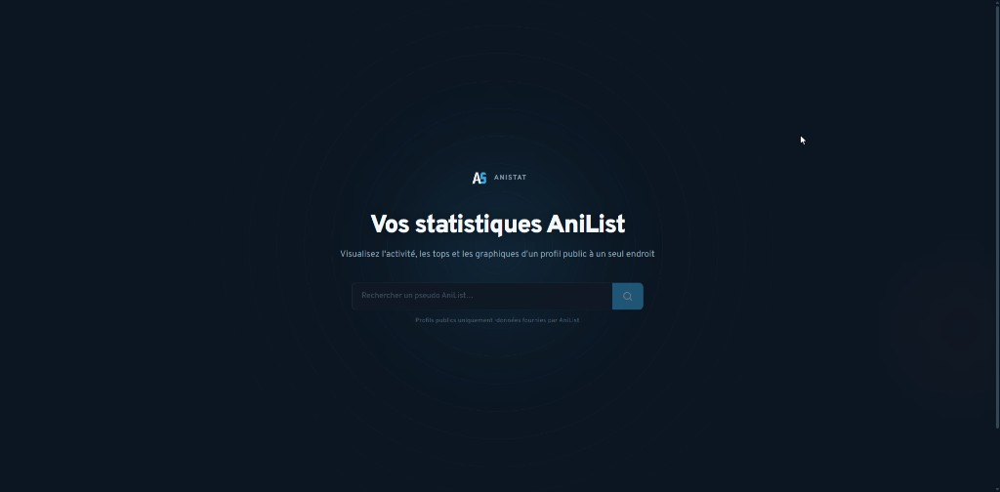
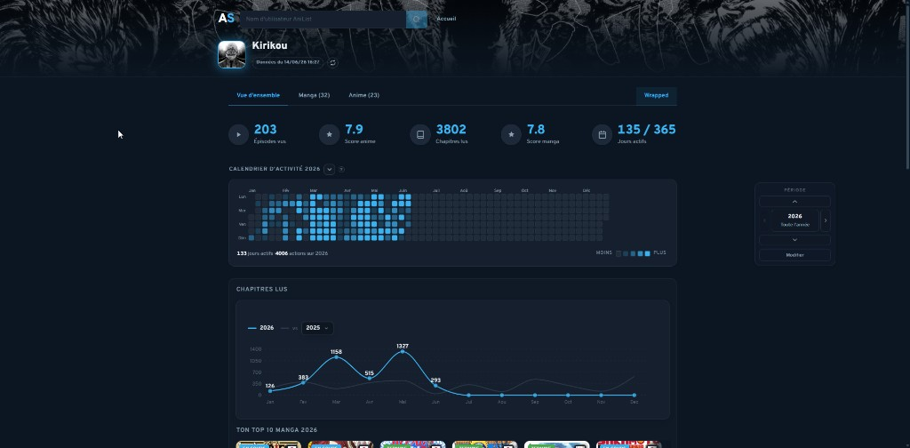
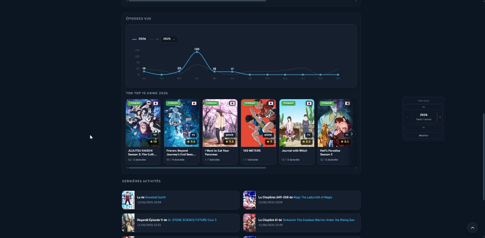
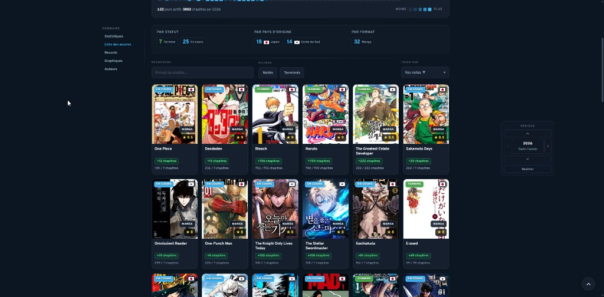
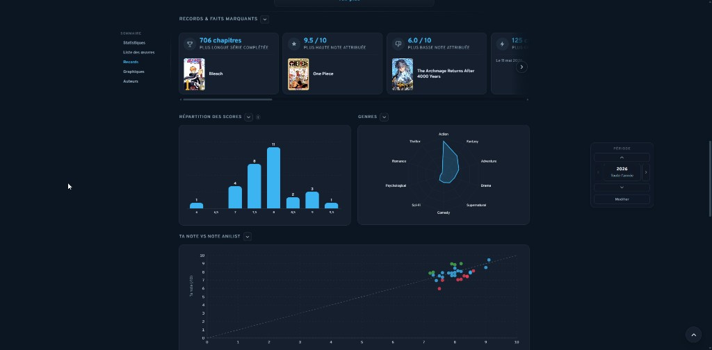
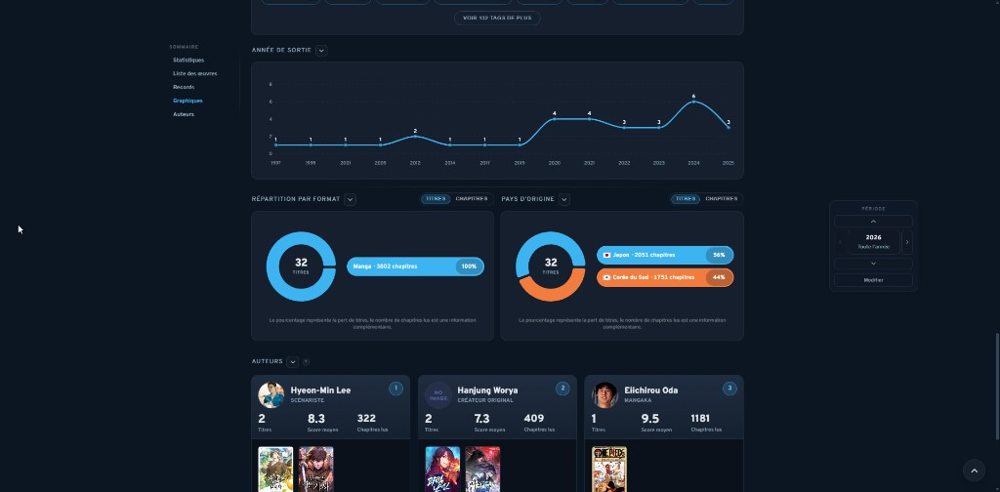

<p align="center">
  
</p>

<h1 align="center">AniStat</h1>

<p align="center">
  <strong>Des statistiques AniList claires, visuelles et partageables.</strong><br />
  Entrez un pseudo public — explorez l’activité, les tops et les graphiques en un clin d’œil.
</p>

<p align="center">
  <a href="https://github.com/Hugoae/AniStat"></a>
  <a href="https://github.com/Hugoae/AniStat"></a>
  <a href="https://github.com/Hugoae/AniStat"></a>
  
  <a href="./LICENSE"></a>
</p>

<p align="center">
  <a href="#-captures-décran">Captures</a> ·
  <a href="#-fonctionnalités">Fonctionnalités</a> ·
  <a href="#-exemple">Exemple</a> ·
  <a href="#-démarrage-rapide">Installation</a> ·
  <a href="./CONTRIBUTING.md">Contribuer</a>
</p>

---

## Aperçu

**AniStat** est un tableau de bord pour les profils AniList publics. Il regroupe anime, manga et activité dans une interface sombre pensée pour la lecture rapide — sans remplacer AniList, en complément.

> Fonctionne avec n’importe quel profil **public** AniList. Aucune connexion requise côté visiteur.

<p align="center">
  
</p>

---

## Captures d’écran

### Vue d’ensemble — stats, heatmap & comparaisons

<p align="center">
  
</p>

<p align="center">
  
</p>

### Manga — liste, records & graphiques

<table>
  <tr>
    <td width="50%">
      
      <p align="center"><em>Liste des œuvres</em></p>
    </td>
    <td width="50%">
      
      <p align="center"><em>Records & faits marquants</em></p>
    </td>
  </tr>
  <tr>
    <td colspan="2">
      
      <p align="center"><em>Graphiques — formats, pays d’origine, auteurs</em></p>
    </td>
  </tr>
</table>

> L’onglet **Anime** propose la même profondeur d’analyse (studios, formats, genres, records…).  
> **AniStat Wrapped** permet d’exporter un récapitulatif annuel en PNG.

---

## Fonctionnalités

### Overview
- **Vue d’ensemble** : totaux anime / manga, notes moyennes, jours actifs, temps de visionnage
- **Heatmap d’activité** annuelle (épisodes vus + chapitres lus)
- **Courbes comparatives** mois par mois vs. une autre période
- **Tops** anime & manga de la période
- **Dernières activités** de consommation (lu, relu, regardé, revu)

### Anime & Manga
- Statistiques détaillées par **année**, **mois** ou **toute la période**
- Graphiques : genres, formats, pays d’origine, notes, tags, sessions…
- **Records** : plus long streak, plus grosse session, complétions les plus rapides, etc.
- Classements **studios** (anime) et **auteurs** (manga)
- Grilles filtrables par statut de liste (terminé, en cours, planifié…)

### AniStat Wrapped
- Récapitulatif **style Wrapped** pour une année donnée
- Stats mises en avant, tops, awards & fun facts
- **Export PNG** pour partager sur les réseaux

---

## Pourquoi AniStat ?

| | AniList | AniStat |
|---|---|---|
| Liste & social | ✅ | — |
| Stats agrégées & graphiques | limité | ✅ |
| Comparaison de périodes | — | ✅ |
| Heatmap & Wrapped | — | ✅ |
| Lecture seule, sans compte | — | ✅ |

---

## Exemple

Essayez avec un profil public, par exemple **`Kirikou`** — entrez le pseudo sur la page d’accueil ou ouvrez directement :

```
https://ani-stat.vercel.app/#/u/Kirikou
```


---

## Démarrage rapide

```bash
git clone https://github.com/Hugoae/AniStat.git
cd AniStat
npm install
cp .env.example .env.local   # puis renseigne les clés Supabase
npm run dev
```

Ouvre [http://127.0.0.1:5173](http://127.0.0.1:5173), entre un pseudo AniList public et explore.

> Configuration Supabase : voir [`supabase/README.md`](./supabase/README.md).

---

## Stack

React · TypeScript · Vite · Recharts · Supabase · API GraphQL AniList

---

## Contribuer

Les retours et suggestions sont les bienvenus ! Consulte [`CONTRIBUTING.md`](./CONTRIBUTING.md) et ouvre une [issue](https://github.com/Hugoae/AniStat/issues).

---

## Disclaimer

AniStat est un projet **non officiel**, indépendant d’[AniList](https://anilist.co).  
Les données appartiennent à leurs utilisateurs respectifs ; les visuels média proviennent d’AniList et de leurs ayants droit.

---

## Auteur

**Hugo Anne** — [GitHub @Hugoae](https://github.com/Hugoae)

Si AniStat t’a été utile, un ⭐ sur le repo fait toujours plaisir.

---

<p align="center">
  <sub>Image social preview pour GitHub : <code>docs/social-preview.png</code> — à uploader dans Settings → General → Social preview</sub>
</p>
